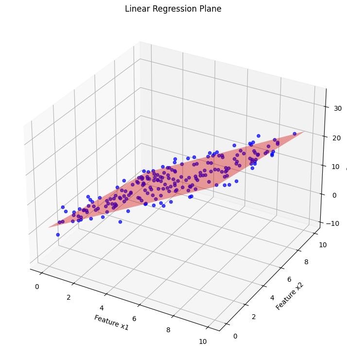

# 📈 Implementação de Algoritmo de Regressão Linear

Este repositório implementa um algoritmo de Regressão Linear do zero para prever valores a partir de um dataset sintético com duas features.

### 📊 Resultado Final
Abaixo está o plano de regressão encontrado pelo modelo em relação aos dados originais.

---

### 🚀 Acesso ao Notebook Completo
Para ver todo o código, a análise e as equações, acesse o notebook:

**[Clique aqui para visualizar o notebook de Regressão Linear](linear_regression.ipynb)**
